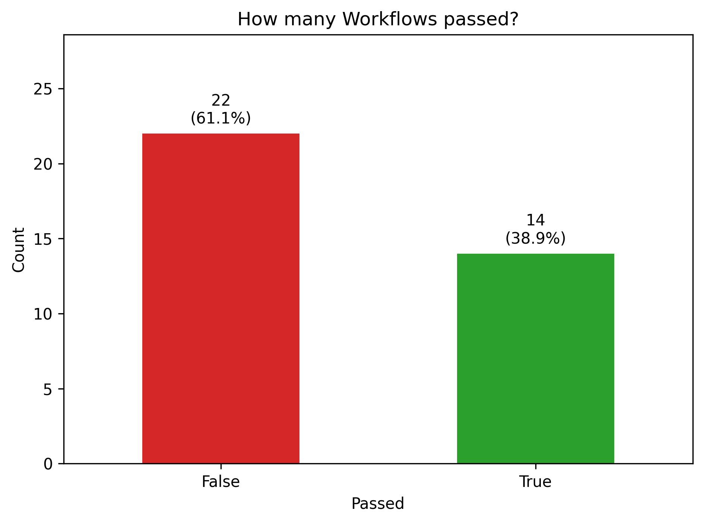
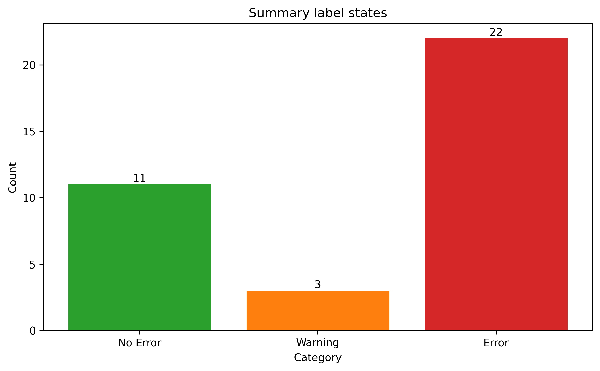
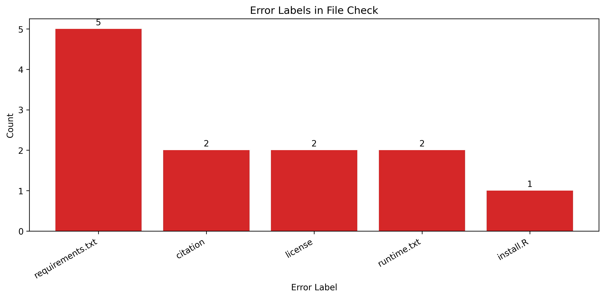
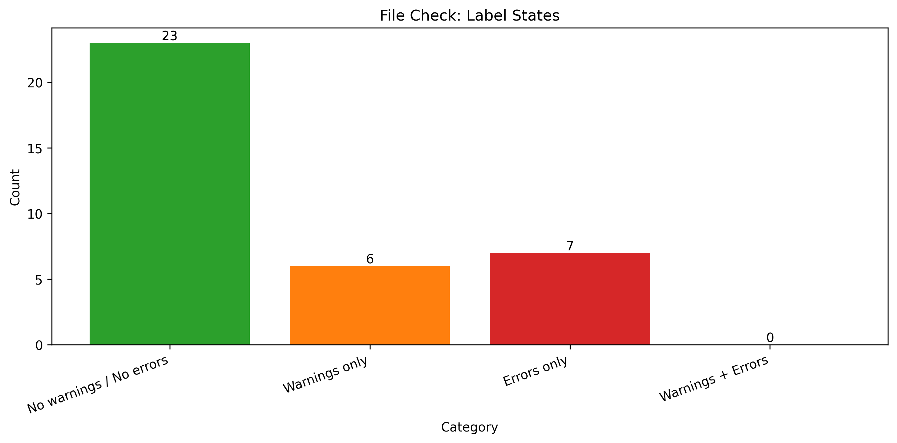
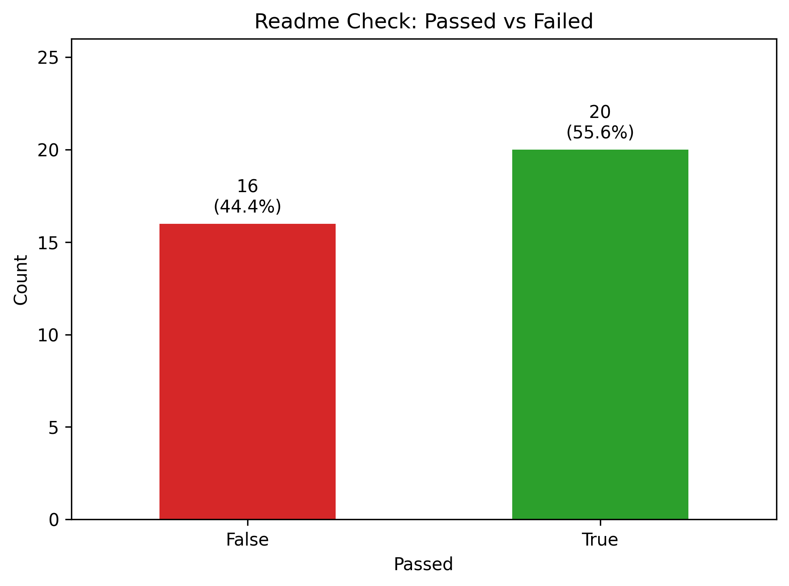
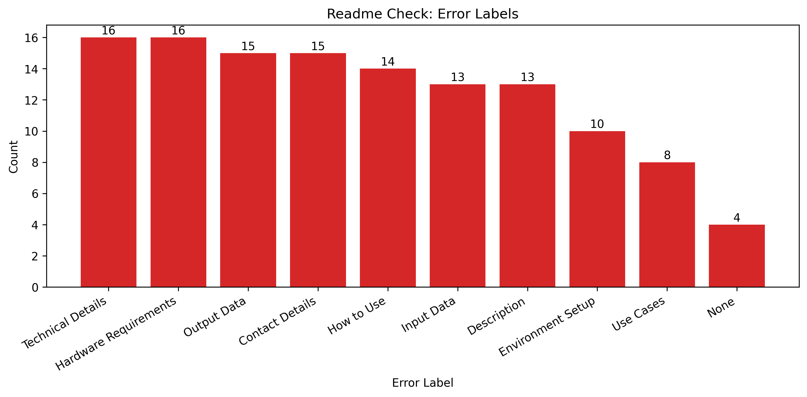
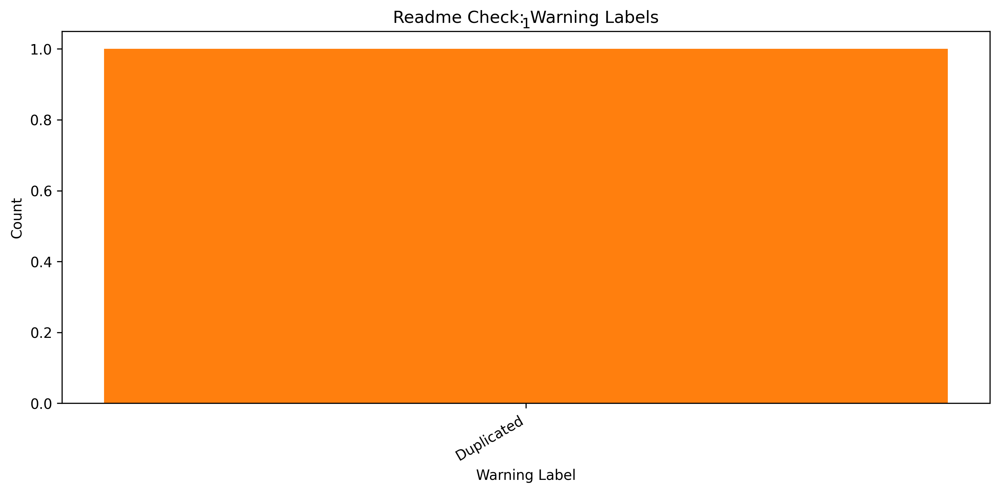
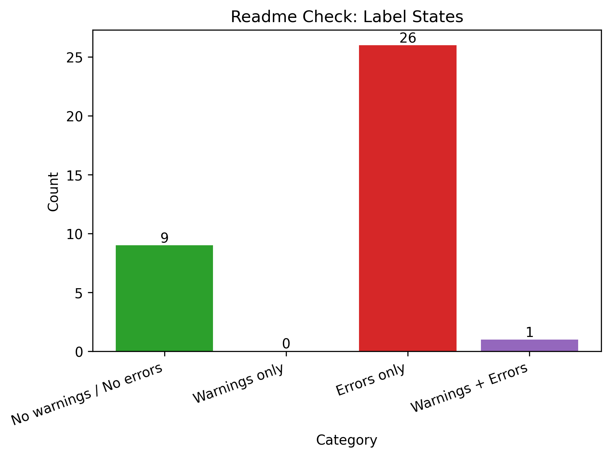
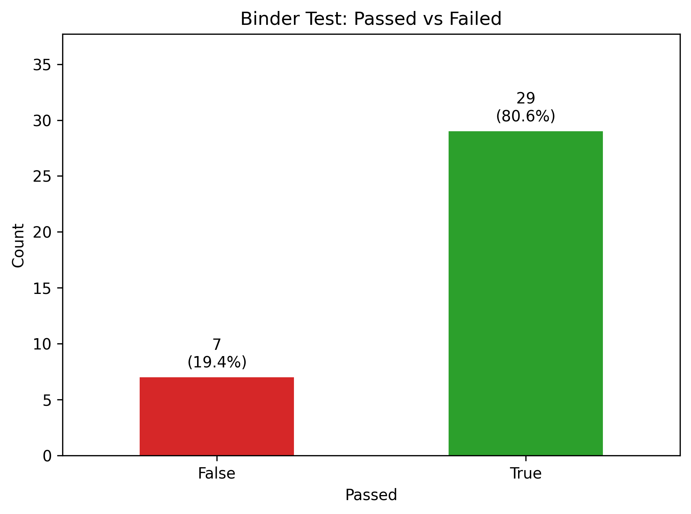

# Strategic Overview

## Summary Results

The total number of workflows is 36.0.

The average workflow duration for successful workflows is 197.0 seconds.

The workflow [mmmaurer/elfen](https://github.com/mmmaurer/elfen) failed.

The workflow [BDA-KTS/academic_mobility_propensity_score](https://github.com/BDA-KTS/academic_mobility_propensity_score) failed.

The workflow [BDA-KTS/NERD-Entity-Fishing](https://github.com/BDA-KTS/NERD-Entity-Fishing) failed.

The workflow [BDA-KTS/4TCT](https://github.com/BDA-KTS/4TCT) failed.

The workflow [BDA-KTS/numeric-group-vis](https://github.com/BDA-KTS/numeric-group-vis) failed.

The workflow [BDA-KTS/Telegram-Data-Collection](https://github.com/BDA-KTS/Telegram-Data-Collection) failed.

The workflow [BDA-KTS/Language_Detection_Tutorial](https://github.com/BDA-KTS/Language_Detection_Tutorial) failed.

The workflow [SEBSCHELLI/MH_SciTweets_Heuristics](https://github.com/SEBSCHELLI/MH_SciTweets_Heuristics) failed.

The workflow [lukasbirki/method_hub_linkage](https://github.com/lukasbirki/method_hub_linkage) failed.

The workflow [schochastics/git_intro](https://github.com/schochastics/git_intro) failed.

The workflow [schochastics/MH_netVizR](https://github.com/schochastics/MH_netVizR) failed.

The workflow [schochastics/MH_netAnaR](https://github.com/schochastics/MH_netAnaR) failed.

The workflow [schochastics/paperwizard](https://github.com/schochastics/paperwizard) failed.

The workflow [schochastics/centrality](https://github.com/schochastics/centrality) failed.

The workflow [chainsawriot/methodshub-weat](https://github.com/chainsawriot/methodshub-weat) failed.

The workflow [gesistsa/grafzahl](https://github.com/gesistsa/grafzahl) failed.

The workflow [gesistsa/webtrackR](https://github.com/gesistsa/webtrackR) failed.

The workflow [gesistsa/oolong](https://github.com/gesistsa/oolong) failed.

The workflow [gesistsa/rang](https://github.com/gesistsa/rang) failed.

The workflow [gesistsa/sweater](https://github.com/gesistsa/sweater) failed.

The workflow [gesiscss/methodshub-bertclassification](https://github.com/gesiscss/methodshub-bertclassification) failed.

The workflow [juliaromberg/methodshub-perspective-annotation-comparison](https://github.com/juliaromberg/methodshub-perspective-annotation-comparison) failed.

## File Check Results

The workflow [mmmaurer/elfen](https://github.com/mmmaurer/elfen) failed.

The workflow [schochastics/git_intro](https://github.com/schochastics/git_intro) failed.

The workflow [chainsawriot/methodshub-weat](https://github.com/chainsawriot/methodshub-weat) failed.

The workflow [gesistsa/grafzahl](https://github.com/gesistsa/grafzahl) failed.

The workflow [gesistsa/oolong](https://github.com/gesistsa/oolong) failed.

The workflow [gesistsa/sweater](https://github.com/gesistsa/sweater) failed.

The following files are missing in the File Check:

 

The workflow [BDA-KTS/Language_Detection_Tutorial](https://github.com/BDA-KTS/Language_Detection_Tutorial) has warnings.

The workflow [schochastics/Rtumblr](https://github.com/schochastics/Rtumblr) has warnings.

The workflow [schochastics/paperwizard](https://github.com/schochastics/paperwizard) has warnings.

The workflow [gesistsa/webtrackR](https://github.com/gesistsa/webtrackR) has warnings.

The workflow [gesistsa/rtoot](https://github.com/gesistsa/rtoot) has warnings.

The workflow [gesistsa/adaR](https://github.com/gesistsa/adaR) has warnings.

## License Check Results

The workflow [BDA-KTS/academic_mobility_propensity_score](https://github.com/BDA-KTS/academic_mobility_propensity_score) failed.

The workflow [BDA-KTS/4TCT](https://github.com/BDA-KTS/4TCT) failed.

The workflow [lukasbirki/method_hub_linkage](https://github.com/lukasbirki/method_hub_linkage) failed.

The workflow [schochastics/git_intro](https://github.com/schochastics/git_intro) failed.

The workflow [chainsawriot/methodshub-weat](https://github.com/chainsawriot/methodshub-weat) failed.

The workflow [gesistsa/oolong](https://github.com/gesistsa/oolong) failed.

Most Common Errors:

 

## Readme Check Results

The workflow [BDA-KTS/numeric-group-vis](https://github.com/BDA-KTS/numeric-group-vis) failed.

The workflow [BDA-KTS/Telegram-Data-Collection](https://github.com/BDA-KTS/Telegram-Data-Collection) failed.

The workflow [BDA-KTS/Language_Detection_Tutorial](https://github.com/BDA-KTS/Language_Detection_Tutorial) failed.

The workflow [SEBSCHELLI/MH_SciTweets_Heuristics](https://github.com/SEBSCHELLI/MH_SciTweets_Heuristics) failed.

The workflow [lukasbirki/method_hub_linkage](https://github.com/lukasbirki/method_hub_linkage) failed.

The workflow [schochastics/git_intro](https://github.com/schochastics/git_intro) failed.

The workflow [schochastics/MH_netVizR](https://github.com/schochastics/MH_netVizR) failed.

The workflow [schochastics/MH_netAnaR](https://github.com/schochastics/MH_netAnaR) failed.

The workflow [schochastics/paperwizard](https://github.com/schochastics/paperwizard) failed.

The workflow [schochastics/centrality](https://github.com/schochastics/centrality) failed.

The workflow [chainsawriot/methodshub-weat](https://github.com/chainsawriot/methodshub-weat) failed.

The workflow [gesistsa/webtrackR](https://github.com/gesistsa/webtrackR) failed.

The workflow [gesistsa/rang](https://github.com/gesistsa/rang) failed.

The workflow [gesistsa/sweater](https://github.com/gesistsa/sweater) failed.

The workflow [gesiscss/methodshub-bertclassification](https://github.com/gesiscss/methodshub-bertclassification) failed.

The workflow [juliaromberg/methodshub-perspective-annotation-comparison](https://github.com/juliaromberg/methodshub-perspective-annotation-comparison) failed.

Most Common Errors:

Most Common Warnings:

 

The workflow [schochastics/centrality](https://github.com/schochastics/centrality) has warnings.

## Binder Test Results

The workflow [BDA-KTS/NERD-Entity-Fishing](https://github.com/BDA-KTS/NERD-Entity-Fishing) failed.

The workflow [juliaromberg/methodshub-perspective-annotation-comparison](https://github.com/juliaromberg/methodshub-perspective-annotation-comparison) failed.

