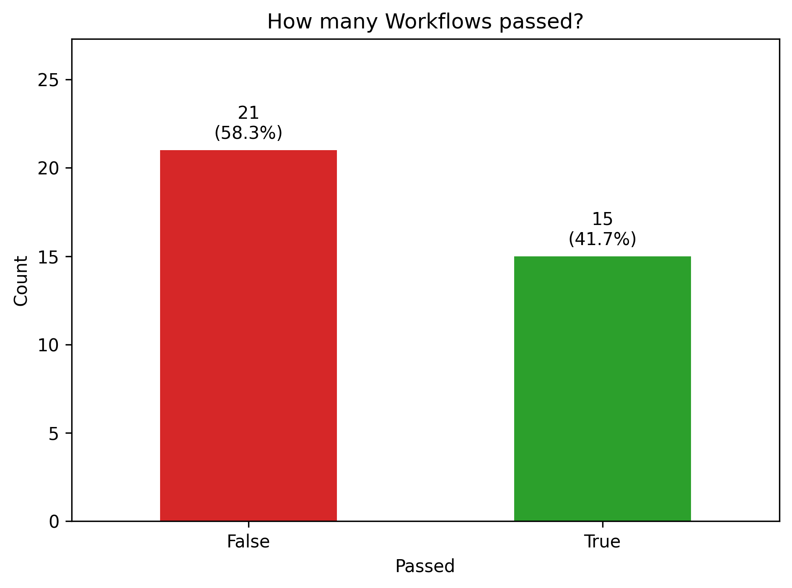
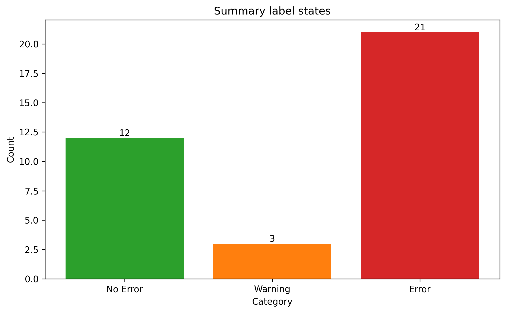
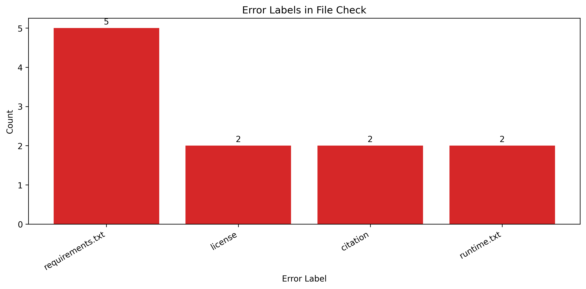
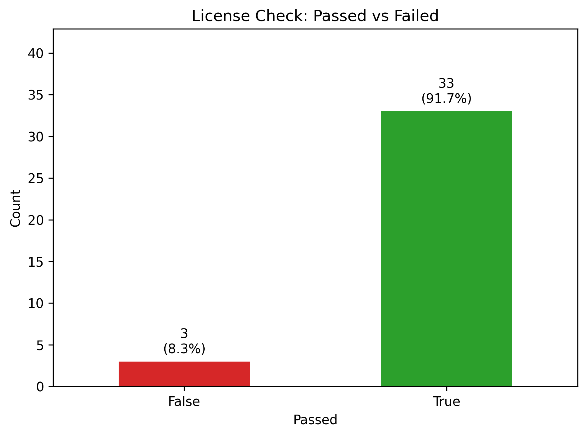
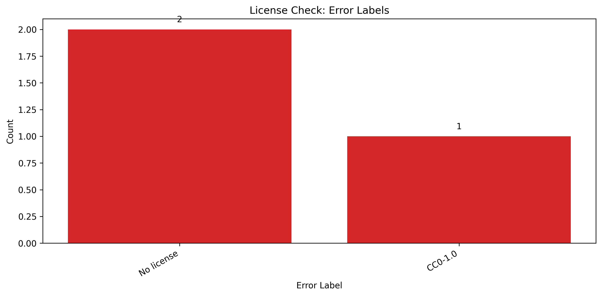
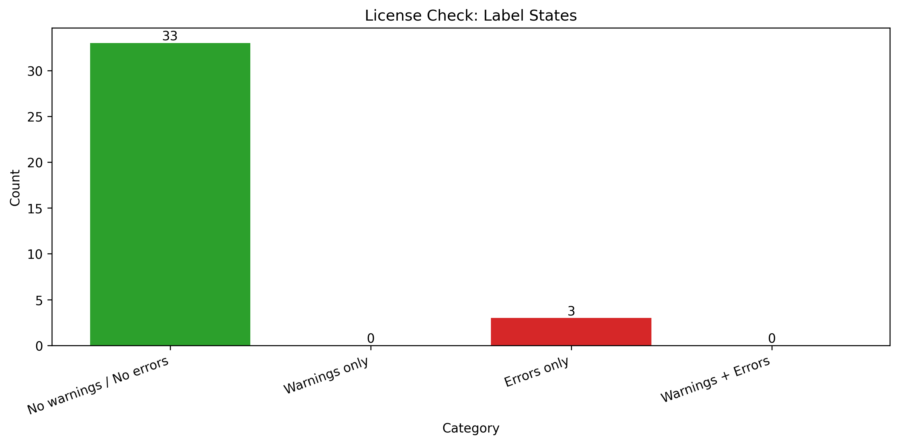
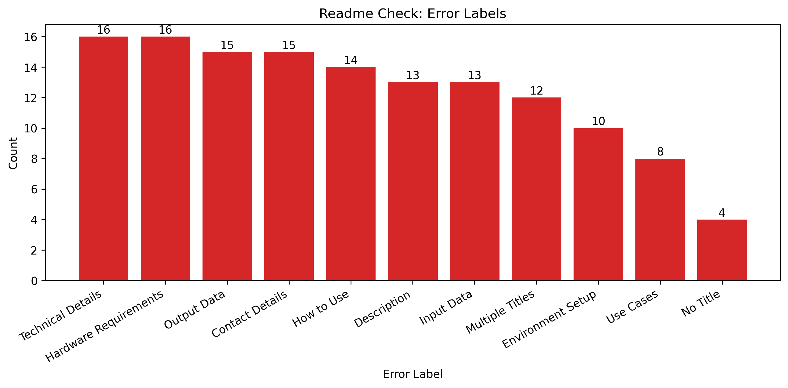
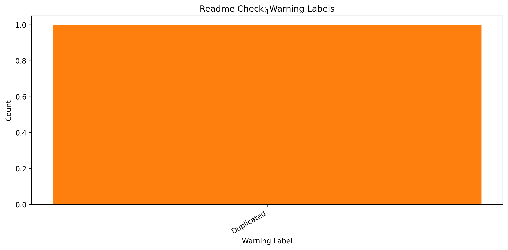
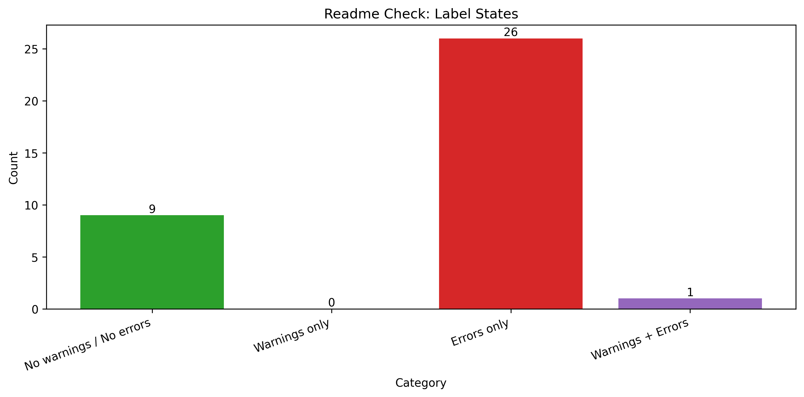
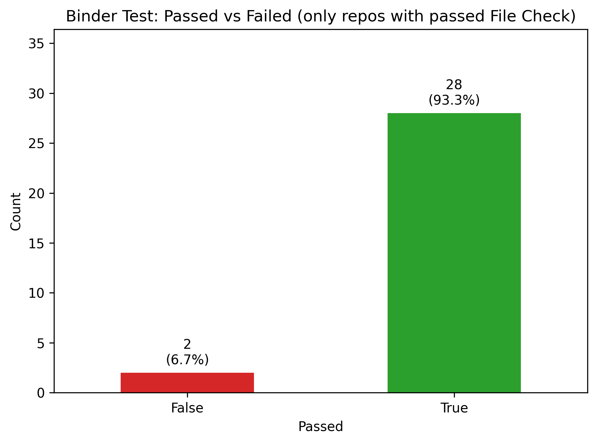

# Strategic Overview

## Summary Results

The total number of workflows is 36.0.

The average workflow duration for successful workflows is 271.0 seconds.

The workflow [schochastics/MH_netAnaR](../report/schochastics/MH_netAnaR.md) failed.

The workflow [schochastics/paperwizard](../report/schochastics/paperwizard.md) failed.

The workflow [schochastics/MH_netVizR](../report/schochastics/MH_netVizR.md) failed.

The workflow [schochastics/centrality](../report/schochastics/centrality.md) failed.

The workflow [schochastics/git_intro](../report/schochastics/git_intro.md) failed.

The workflow [gesistsa/oolong](../report/gesistsa/oolong.md) failed.

The workflow [gesistsa/grafzahl](../report/gesistsa/grafzahl.md) failed.

The workflow [gesistsa/sweater](../report/gesistsa/sweater.md) failed.

The workflow [gesistsa/rang](../report/gesistsa/rang.md) failed.

The workflow [gesistsa/webtrackR](../report/gesistsa/webtrackR.md) failed.

The workflow [gesiscss/methodshub-bertclassification](../report/gesiscss/methodshub-bertclassification.md) failed.

The workflow [chainsawriot/methodshub-weat](../report/chainsawriot/methodshub-weat.md) failed.

The workflow [juliaromberg/methodshub-perspective-annotation-comparison](../report/juliaromberg/methodshub-perspective-annotation-comparison.md) failed.

The workflow [lukasbirki/method_hub_linkage](../report/lukasbirki/method_hub_linkage.md) failed.

The workflow [mmmaurer/elfen](../report/mmmaurer/elfen.md) failed.

The workflow [BDA-KTS/academic_mobility_propensity_score](../report/BDA-KTS/academic_mobility_propensity_score.md) failed.

The workflow [BDA-KTS/Telegram-Data-Collection](../report/BDA-KTS/Telegram-Data-Collection.md) failed.

The workflow [BDA-KTS/NERD-Entity-Fishing](../report/BDA-KTS/NERD-Entity-Fishing.md) failed.

The workflow [BDA-KTS/Language_Detection_Tutorial](../report/BDA-KTS/Language_Detection_Tutorial.md) failed.

The workflow [BDA-KTS/numeric-group-vis](../report/BDA-KTS/numeric-group-vis.md) failed.

The workflow [SEBSCHELLI/MH_SciTweets_Heuristics](../report/SEBSCHELLI/MH_SciTweets_Heuristics.md) failed.

## File Check Results

The workflow [schochastics/git_intro](../report/schochastics/git_intro.md) failed.

The workflow [gesistsa/oolong](../report/gesistsa/oolong.md) failed.

The workflow [gesistsa/grafzahl](../report/gesistsa/grafzahl.md) failed.

The workflow [gesistsa/sweater](../report/gesistsa/sweater.md) failed.

The workflow [chainsawriot/methodshub-weat](../report/chainsawriot/methodshub-weat.md) failed.

The workflow [mmmaurer/elfen](../report/mmmaurer/elfen.md) failed.

The following files are missing in the File Check:

 

The workflow [schochastics/paperwizard](../report/schochastics/paperwizard.md) has warnings.

The workflow [schochastics/Rtumblr](../report/schochastics/Rtumblr.md) has warnings.

The workflow [gesistsa/webtrackR](../report/gesistsa/webtrackR.md) has warnings.

The workflow [gesistsa/rtoot](../report/gesistsa/rtoot.md) has warnings.

The workflow [gesistsa/adaR](../report/gesistsa/adaR.md) has warnings.

The workflow [BDA-KTS/Language_Detection_Tutorial](../report/BDA-KTS/Language_Detection_Tutorial.md) has warnings.

## License Check Results

The workflow [schochastics/git_intro](../report/schochastics/git_intro.md) failed.

The workflow [chainsawriot/methodshub-weat](../report/chainsawriot/methodshub-weat.md) failed.

The workflow [BDA-KTS/academic_mobility_propensity_score](../report/BDA-KTS/academic_mobility_propensity_score.md) failed.

Most Common Errors:

 

## Readme Check Results

The workflow [schochastics/MH_netAnaR](../report/schochastics/MH_netAnaR.md) failed.

The workflow [schochastics/paperwizard](../report/schochastics/paperwizard.md) failed.

The workflow [schochastics/MH_netVizR](../report/schochastics/MH_netVizR.md) failed.

The workflow [schochastics/centrality](../report/schochastics/centrality.md) failed.

The workflow [schochastics/git_intro](../report/schochastics/git_intro.md) failed.

The workflow [gesistsa/sweater](../report/gesistsa/sweater.md) failed.

The workflow [gesistsa/rang](../report/gesistsa/rang.md) failed.

The workflow [gesistsa/webtrackR](../report/gesistsa/webtrackR.md) failed.

The workflow [gesiscss/methodshub-bertclassification](../report/gesiscss/methodshub-bertclassification.md) failed.

The workflow [chainsawriot/methodshub-weat](../report/chainsawriot/methodshub-weat.md) failed.

The workflow [juliaromberg/methodshub-perspective-annotation-comparison](../report/juliaromberg/methodshub-perspective-annotation-comparison.md) failed.

The workflow [lukasbirki/method_hub_linkage](../report/lukasbirki/method_hub_linkage.md) failed.

The workflow [BDA-KTS/Telegram-Data-Collection](../report/BDA-KTS/Telegram-Data-Collection.md) failed.

The workflow [BDA-KTS/Language_Detection_Tutorial](../report/BDA-KTS/Language_Detection_Tutorial.md) failed.

The workflow [BDA-KTS/numeric-group-vis](../report/BDA-KTS/numeric-group-vis.md) failed.

The workflow [SEBSCHELLI/MH_SciTweets_Heuristics](../report/SEBSCHELLI/MH_SciTweets_Heuristics.md) failed.

Most Common Errors:

Most Common Warnings:

 

The workflow [schochastics/centrality](../report/schochastics/centrality.md) has warnings.

## Binder Test Results

The workflow [juliaromberg/methodshub-perspective-annotation-comparison](../report/juliaromberg/methodshub-perspective-annotation-comparison.md) failed.

The workflow [BDA-KTS/NERD-Entity-Fishing](../report/BDA-KTS/NERD-Entity-Fishing.md) failed.

